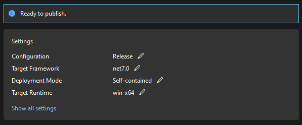

# Issue Labeler Disaster Recovery Instructions

In events where all service instances need to be re-deployed, the following steps will guide you through the process.

1. Open and build the `issue-labeler.sln` solution to ensure a baseline build
    - There will be build messages and warnings, but there should be no errors
2. Make the changes necessary
    - If any package versions need to be bumped, the `eng\Versions.props` file controls all package versions
3. Rebuild the solution
4. Publish the `IssueLabelerService` project to the `dispatcher-app` service instance
    - Right click on the `IssueLabelerService` project and choose **Publish...**
    - If you don't yet have a publish profile saved, you will be guided through creating one
        - Target: **Azure**
        - Specific Target: **Azure App Service (Windows)**
        - Subscription Name: **DDFun IaaS Dev Shared Public**
        - Choose the `dispatcher-app` App Service instance from the `GitHubIssueLabeller` folder
          
        - **Check the 'Deploy as ZIP package' box**
        - Deployment type: **Publish (generates pubxml file)**
        - Click Finish and close the window when it's complete
     - In the Settings screen click one of the pencil icons to edit the Settings and make sure the following are set:
       
       - **Configuration**: Release
       - **Target framework**: net7.0
       - **Deployment mode**: Self-contained
       - **Target Runtime**: win-x64
       - Click **Save**
     - Click **Publish** (this will build the app and upload to Azure, and can take a few minutes)
5. Publish the `PredictionService` project to all of the other service instances
    - Right click on the `PredictionService` project and choose **Publish...**
    - If you don't yet have a publish profile saved, you will be guided through creating one
        - Target: **Azure**
        - Specific Target: **Azure App Service (Windows)**
        - Subscription Name: **DDFun IaaS Dev Shared Public**
        - Choose the App Service instance from the `GitHubIssueLabeller` folder, e.g. `nuget-home-labeler`
          
        - **Check the 'Deploy as ZIP package' box**
        - Deployment type: **Publish (generates pubxml file)**
        - Click Finish and close the window when it's complete
     - In the Settings screen click one of the pencil icons to edit the Settings and make sure the following are set:
       
       - **Configuration**: Release
       - **Target framework**: net7.0
       - **Deployment mode**: Self-contained
       - **Target Runtime**: win-x64
       - Click **Save**
     - Click **Publish** (this will build the app and upload to Azure, and can take a few minutes)
        - Once finished, a browser window will open for the App Service instance,
     - Repeat these steps of publishing the `PredictionService` to each of the remaining App Service instances by clicking **+ New profile**
        - Be careful not to deploy the `PredictionService` to the `dispatcher-app` instance
        - Be sure to edit the publish configuration for each profile created
6. Test the deployments
    - Right-click on the `test/IssueLabelerService.DeploymentTests` project and **Run Tests**
    - The `IssueLabelingTests.cs` file includes detailed notes for how to get full application logs should any tests fail
